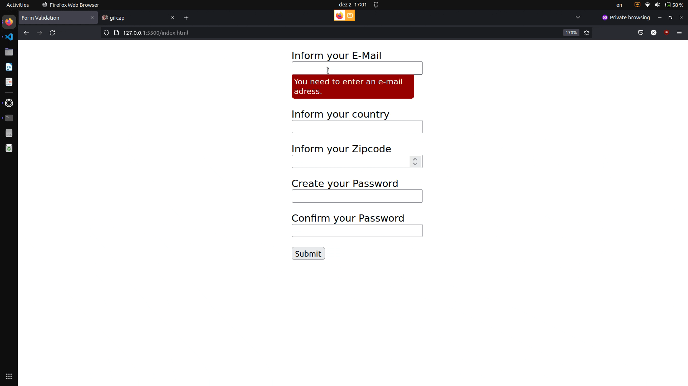

# form_validation
## Applying Constraint Validation API methods to validate a form.

### Features: 
- Form validation for numeric, email and alphabetic types;
- Customized validation for matching passwords;
- Custom GUI styling for alerts.
 
### Technical notes about project development:
First experience with applying the DOM form validation methods which open up the customization options and expand its capabilities.
It is always good to have a robust client-side validation process to avoid bigger problems at the backend afterwards.
Moving forward I will seek to implement an API that validates country names and if the informed zipcode is valid for the given region.

